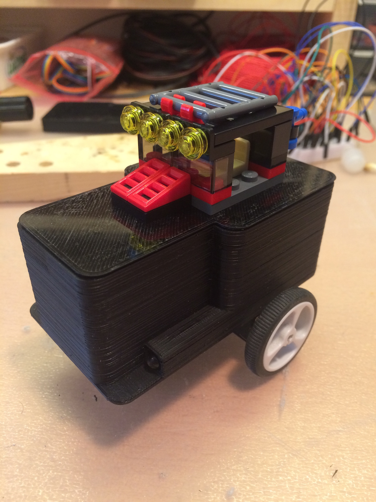
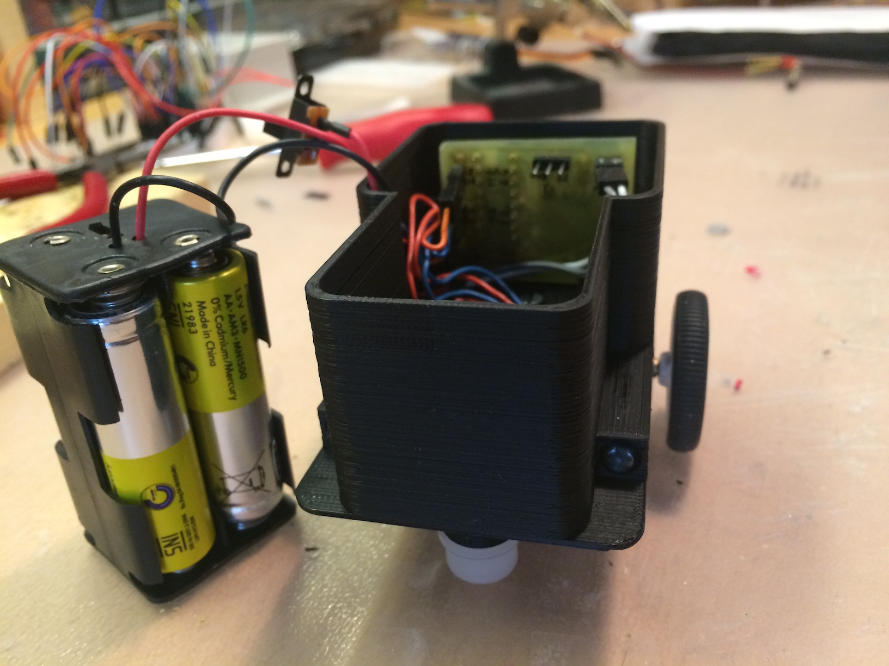
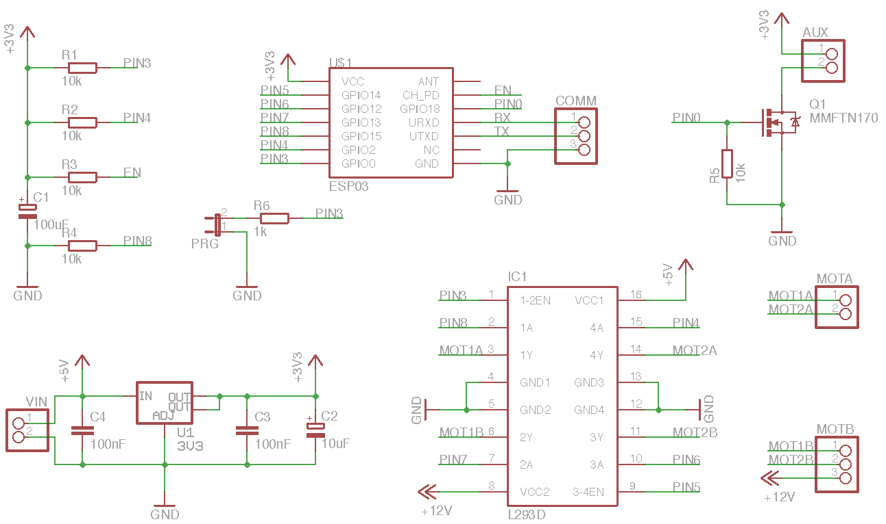
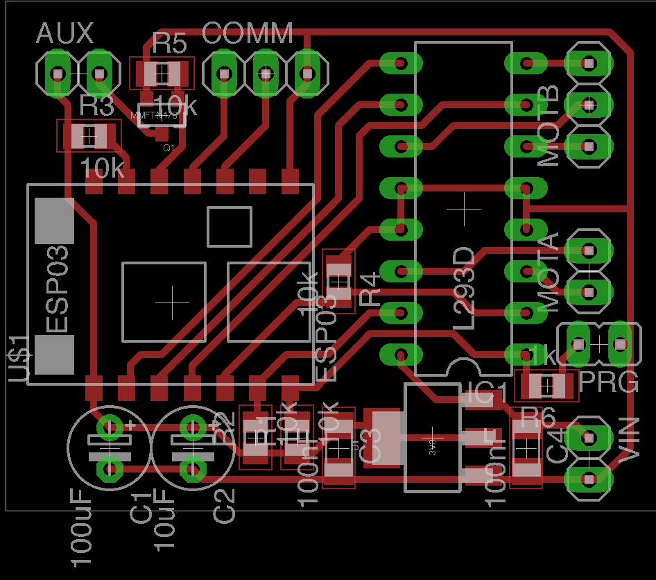
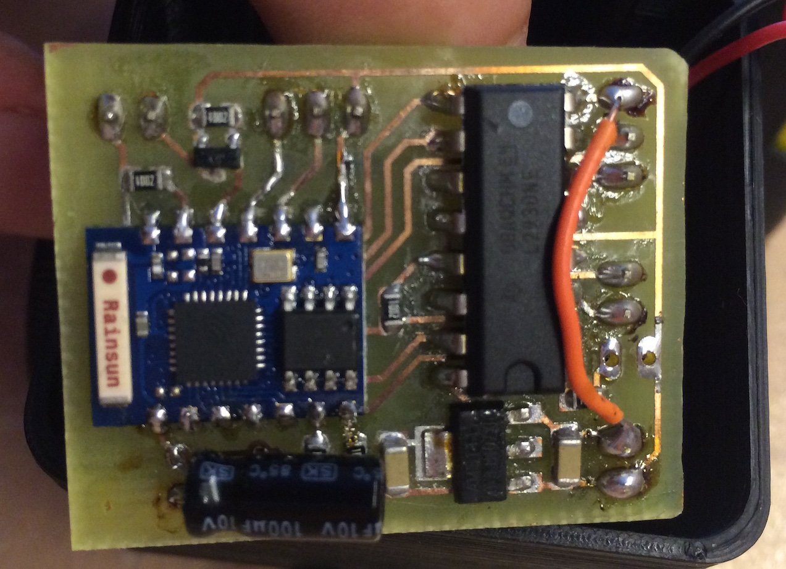

# WiFi controlled toy car

Made as a present for my friend's birthday 

* ESP-8266 with NodeMCU
* L293 dual H-bridge driver
* Small geared DC motors
* Pololu wheels and idler
* 3D printed case
* iOS app for car control

## Photos

## Schematic and PCB

